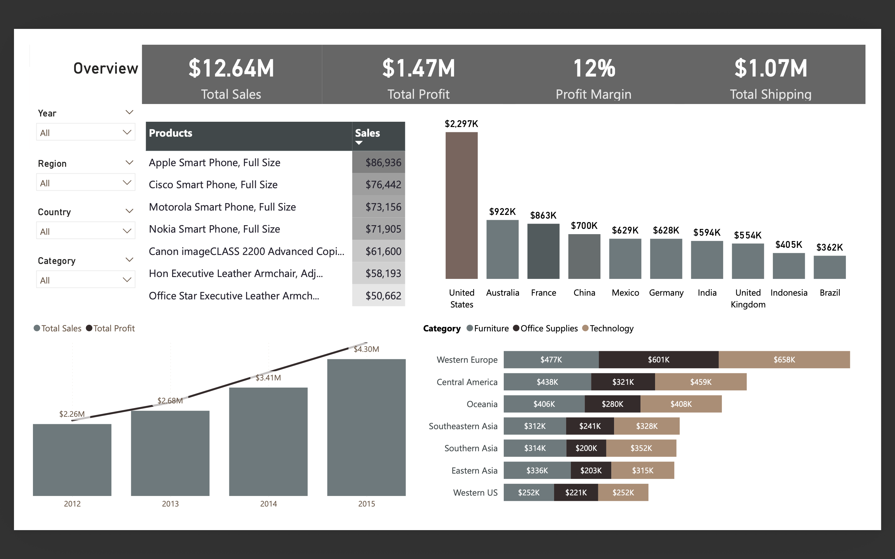

# 📊 Sales & Profit Analysis Dashboard

## 🧩 Business Problem

The company operates across multiple global regions and offers various discount levels and shipping options. Management needs to understand how discounts and logistics decisions affect profitability across markets.

---

## 🎯 Project Goals

- Analyze sales and profit dynamics over time
- Evaluate the impact of discount levels on profitability
- Identify high-performing regions and product categories
- Assess shipping modes efficiency

---

## 🛠 Tools Used

- Power BI
- Power Query
- DAX
- Data Modeling

---

## 📁 Dataset

Superstore dataset including:
- Orders
- Product
- Address
- Customers
- Returns
- Sales Representatives

---

## 📊 Dashboard Pages

- Overview
- Monthly Financial Performance
- Discount vs Profit Analysis
- Regional & Market Performance
- Market & Product Performance
- Ship Mode & Priority Analysis

---

## 🔍 Key Insights

- Discounts above 20% significantly reduce profitability
- Discounts above 40% lead to negative profit margins
- Certain regions demonstrate stable sales but low profitability
- Technology category generates the highest revenue
- Standard Class shipping accounts for the majority of revenue

---

## 📌 Business Recommendations

- Limit excessive discount levels
- Optimize shipping strategies
- Reevaluate pricing in low-margin regions
- Focus on high-performing product categories

---

## 📊 Dashboard Preview

[View Sales & Profit Dashboard (PDF)](Super_Store_sales_profit_analysis.pdf)

---
## Key Insights

- Profitability significantly varies across regions, with some high-revenue markets demonstrating below-average profit margins.
- Orders with higher discount levels tend to generate lower profit, despite contributing positively to total sales volume.
- Certain product categories consistently maintain higher profit margins regardless of discount level.
- Shipping cost varies across ship modes and impacts overall profitability in low-margin segments.
- Monthly performance analysis indicates seasonal fluctuations in both sales and profit across regions.
